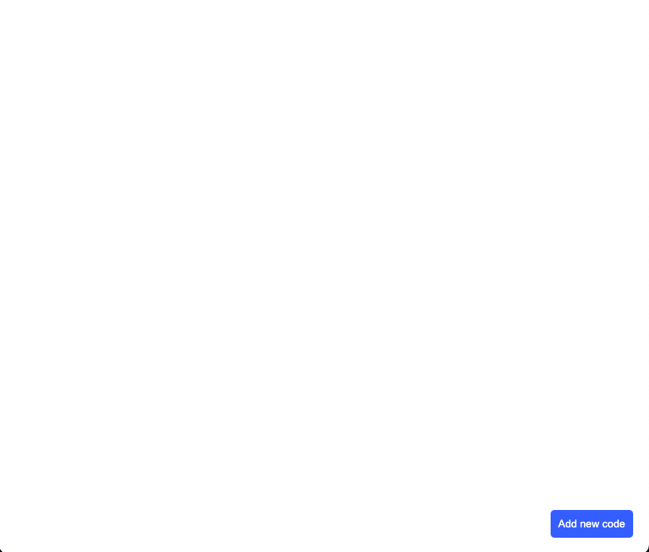
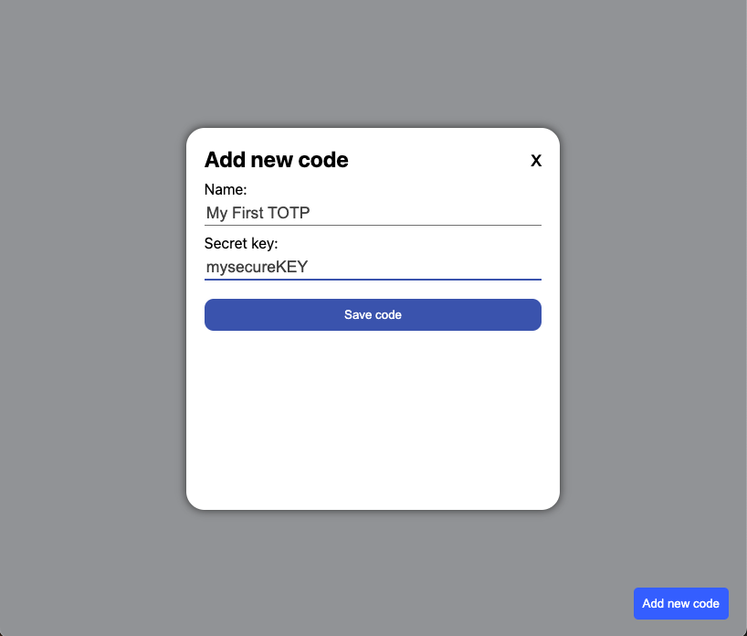
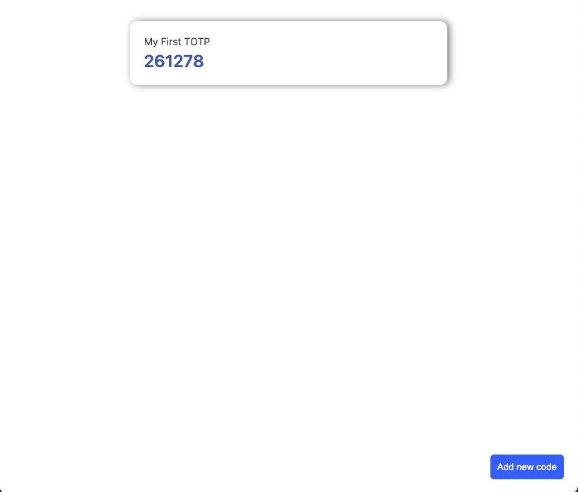

# TOTP Desktop Application

This is a desktop application for TOTP generation. UI of this app is built with ReactJS and packaged as desktop app with ElectronJS.

The key features of this application are:

- **Lightweight** It is a simple website combined with web engine to be launched as desktop application;
- **Security** - all your codes and keys are stored locally on your machine and nobody can get access to them. If you are familiar with web development, then you should know that all data is stored in *localStorage*.

## How to install

To install this application you need to open the [application releases page](https://github.com/KrawMire/totp-app/releases/) and go to the latest version (`v0.0.1` for now). Then you should download files depending on what platform are you working on.

### Windows

For Windows I created only portable version. So you need to download file `totp-app.0.1.0.exe` and then launch it. Now you are ready to use it!  

### MacOS

Download `totp-app-0.1.0-arm64.dmg` file and open it. You will see an opened window where you need to move an application to the `Applications` folder in your machine. Then open *Spotlight search* (`command+space`) and input "totp". You will see newly installed application. Open it and use!

### Linux

Unfortunately, I haven't tested Linux installation, so I suppose if you are Linux user you can find out it by yourself.

## How to use

1. Open an application. You will see empty screen and one button in left bottom corner;
   
2. Click at `Add new code` button and you will see modal window to add new code. Input name of your code and a secret key into specified fields;
   
3. Click `Save code` button and close a modal window. You will see your freshly added code.
   

Codes are updated every 30 seconds automatically. But if you want, you can reload the main page manually using `command+R` for MacOS or `ctrl+R` for Windows or from top menu bar.